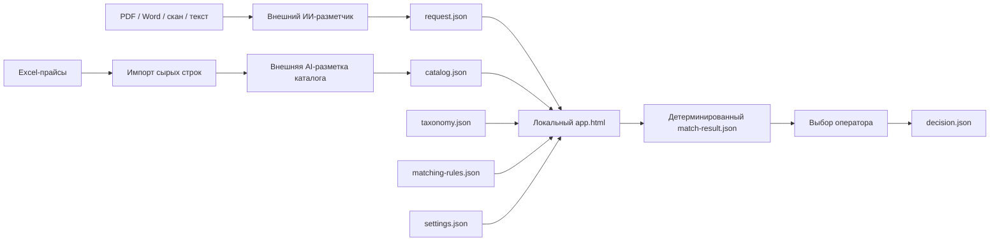
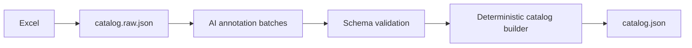

# Архитектурное техническое задание
## Локальное приложение детерминированного подбора товаров по размеченным JSON

**Статус:** готово к ревью владельцем продукта  
**Версия документа:** 1.0  
**Дата:** 2026-07-28  
**Целевой репозиторий:** GitHub  
**Целевой исполнитель реализации:** Codex  
**Поддерживаемые браузеры:** актуальные настольные Google Chrome и Microsoft Edge  
**Формат поставки приложения:** один автономный HTML-файл без backend и без сетевых зависимостей

---

## 1. Назначение документа

Этот документ фиксирует архитектуру системы, которая:

1. хранит размеченный каталог товаров и коммерческих предложений в JSON;
2. принимает размеченную входящую заявку в JSON;
3. детерминированно сопоставляет позиции заявки с товарами каталога;
4. последовательно ищет:
   - точное изделие — `exact`;
   - технический эквивалент — `equivalent`;
   - допустимую альтернативу — `alternative`;
5. показывает оператору объяснимый результат;
6. сохраняет результаты и выбор оператора в локальные JSON-файлы.

Документ является нормативной архитектурной основой. На его базе отдельно должен быть подготовлен план реализации в виде последовательности Pull Request. Настоящий документ не является планом PR и не задает порядок коммитов.

Ключевые слова **MUST**, **MUST NOT**, **SHOULD**, **SHOULD NOT**, **MAY** используются в нормативном смысле:

- **MUST / MUST NOT** — обязательное требование;
- **SHOULD / SHOULD NOT** — рекомендуемое требование, отклонение требует обоснования;
- **MAY** — допустимый вариант реализации.

---

## 2. Основание и фактические входные данные

Архитектура спроектирована на основе предоставленных материалов:

1. `01 ПРАЙС-ЛИСТ ООО РТП 30.06.2026.xlsm`;
2. `02 Новинки ПРАЙСА 2026.xlsx`;
3. `03 ПРАЙС РАСПРОДАЖА (30.06.2026).xlsx`;
4. `04 ПРАЙС ДИСТРИБЬЮЦИЯ 30.06.2026.xlsx`;
5. `ТЕХНОЛОГИЧЕСКИЕ РЕШЕНИЯ-ФИТИНГИ-ТРУБЫ.pdf`;
6. `Реквизиты ООО ФЕНИКС Альфа.docx`.

### 2.1. Наблюдения по прайсам

Основной прайс содержит свыше 3,3 тыс. номенклатурных записей. В нормализованном служебном листе `Лист1` присутствуют поля:

- лист или направление прайса;
- внутренний код;
- исходное наименование;
- номенклатурная группа;
- ценовая группа;
- упаковка;
- вес;
- объем;
- штрихкод;
- единица или параметр размера;
- цена;
- признак распродажи;
- дополнительный признак направления;
- ABC-класс.

В прайсе новинок используются секции, артикул, штрихкод, параметры, вес, упаковка и цена. Часть данных подтягивается формулами из общего служебного листа.

В распродаже присутствуют как товары общего каталога, так и секция ликвидационных позиций, отсутствующих в основном прайсе. Следовательно, товар нельзя считать существующим только при наличии в основном пуле.

Дистрибьюторский прайс содержит отдельные листы брендов и дополнительный лист описаний. Помимо кода, наименования, штрихкода, упаковки и цены встречаются:

- наличие: `На складе`, `Под заказ`;
- развернутое техническое описание;
- комплектность;
- модель или артикул производителя внутри наименования.

### 2.2. Наблюдения по входящим документам

PDF-заявка содержит несколько технологических разделов, товарные строки и смешанные способы описания изделий:

- точный производитель, модель или код;
- стандарт и типоразмер;
- функциональное описание без артикула;
- материал, резьбу, диаметр, давление и другие параметры;
- формулировку `или эквивалент`;
- количество и единицу измерения.

Word-файл является карточкой предприятия с реквизитами и не содержит товарной заявки. Следовательно, внешний ИИ-разметчик MUST сначала классифицировать документ и отделять товарные строки от реквизитов, заголовков, примечаний и служебного текста.

### 2.3. Архитектурный вывод

Одинаковое изделие может одновременно иметь:

- разные наименования;
- разные бренды и заводские артикулы;
- одинаковую техническую конфигурацию;
- несколько коммерческих предложений из разных прайс-пулов;
- разные цены, упаковки и доступность.

Поэтому техническая сущность товара, идентичность конкретного изделия и коммерческое предложение MUST быть разделены.

---

## 3. Цели системы

### 3.1. Бизнес-цели

Система должна:

1. сокращать ручной поиск позиций по нескольким прайсам;
2. находить товары независимо от формулировки входящей заявки;
3. корректно различать однотипные изделия с разными присоединениями и параметрами;
4. предлагать несколько вариантов, когда подходит несколько товаров;
5. объяснять оператору, почему товар найден и чем он отличается;
6. исключить недетерминированные решения ИИ на этапе подбора;
7. работать полностью локально без передачи прайсов и заявок наружу.

### 3.2. Технические цели

Система MUST обеспечивать:

- одинаковый результат сопоставления при одинаковых входных данных и версиях правил;
- проверку всех входных JSON по схемам;
- версионирование таксономии, правил и каталога;
- стабильные идентификаторы товаров и предложений;
- объяснимые результаты без непрозрачного `AI score`;
- автономную работу в Chrome и Edge;
- отсутствие backend, базы данных и обязательного локального сервера;
- сборку исходного кода в один автономный `app.html`.

---

## 4. Не входит в объем первой версии

Следующие функции являются явными non-goals:

- распознавание PDF, Word, изображений или Excel внутри браузерного приложения;
- вызов API языковой модели из приложения;
- embeddings, векторная база и семантический поиск;
- подбор товара непосредственно языковой моделью;
- обучение модели на действиях оператора;
- серверная база данных;
- многопользовательская конкурентная работа с одной папкой;
- учет остатков в реальном времени;
- интеграция с 1С, ERP, CRM или электронной почтой;
- автоматическое формирование счета или коммерческого предложения;
- визуальный конструктор таксономии и правил;
- автоматические миграции несовместимых major-версий JSON;
- поддержка Firefox, Safari и мобильных браузеров.

Преобразование исходных Excel-прайсов в размеченный каталог и преобразование документов-заявок в `request.json` относятся к внешнему контуру подготовки данных. В репозитории должны храниться их форматы, схемы, примеры и проверочные инструменты, но runtime-приложение не выполняет OCR или AI-аннотацию.

---

## 5. Главный архитектурный принцип

ИИ выполняет только разметку. Сопоставление выполняет только детерминированный программный движок.



### 5.1. ИИ MAY

ИИ MAY:

- выделять товарные строки;
- определять `class_id` из разрешенного списка;
- извлекать явно указанные идентификаторы;
- извлекать явно указанные технические характеристики;
- нормализовать обозначения и единицы по переданным справочникам;
- определять смысл операторов `равно`, `не менее`, `не более`, `один из`;
- распознавать явный запрет или разрешение замены;
- указывать неоднозначности;
- прикладывать evidence — исходный фрагмент, страницу, строку или ячейку;
- сообщать confidence только как метаданные контроля качества разметки.

### 5.2. ИИ MUST NOT

ИИ MUST NOT:

- видеть каталог для выбора подходящего товара при разметке заявки;
- возвращать `product_id`, `offer_id` или рекомендованную позицию;
- присваивать `exact`, `equivalent` или `alternative`;
- рассчитывать similarity score;
- определять критичность технического поля;
- решать, допустимо ли отличие;
- придумывать отсутствующие характеристики;
- подменять неизвестное значение наиболее вероятным;
- генерировать технический ключ эквивалентности;
- сортировать кандидатов.

### 5.3. Детерминированное приложение MUST

Приложение MUST:

- работать только со структурированными JSON;
- игнорировать `raw_text` при математике сопоставления;
- применять только версионированные правила;
- выдавать одинаковый результат независимо от формулировки исходного текста после его разметки;
- объяснять каждое совпадение и каждое разрешенное отклонение идентификатором правила.

---

## 6. Логическая модель предметной области

Система разделяет пять сущностей.

```text
ProductClass
    ↓ задает структуру и правила
TechnicalProduct
    ↓ конкретизируется идентичностью
ProductIdentity
    ↓ продается через
CatalogOffer

RequestLine
    ↓ сопоставляется с TechnicalProduct / ProductIdentity
```

### 6.1. `ProductClass`

Тип изделия, например:

- PPR-тройник под раструбную сварку;
- комбинированная муфта PPR с наружной резьбой;
- труба PERT;
- кран шаровой;
- манометр;
- анаэробный герметик;
- сварочный аппарат.

Класс определяет:

- допустимые поля;
- типы значений;
- структуру присоединений;
- симметрию портов;
- минимально необходимые данные заявки;
- критические поля технической эквивалентности;
- доступные профили альтернатив.

### 6.2. `TechnicalProduct`

Техническое изделие без коммерческой информации. Содержит:

- `class_id`;
- нормализованные характеристики;
- присоединения;
- совместимость;
- исходные данные и provenance.

### 6.3. `ProductIdentity`

Идентичность конкретного изделия производителя:

- бренд;
- производитель;
- модель;
- серия;
- заводской артикул;
- GTIN;
- внутренний код поставщика.

### 6.4. `CatalogOffer`

Коммерческое предложение:

- прайс-пул;
- цена;
- валюта;
- единица продажи;
- упаковка;
- наличие;
- дата или версия прайса.

Цена, упаковка и наличие MUST NOT входить в техническую эквивалентность товара.

### 6.5. `RequestLine`

Формализованная позиция заявки:

- исходная строка;
- количество;
- класс изделия;
- запрошенная идентичность;
- технические ограничения;
- политика замены, извлеченная из текста;
- неоднозначности и evidence.

---

## 7. Физическая архитектура решения

### 7.1. Runtime

Runtime представляет собой один файл:

```text
app.html
```

Он MUST содержать внутри себя:

- HTML;
- CSS;
- JavaScript-бандл;
- JSON Schema validator;
- все сторонние runtime-зависимости;
- иконки и статические ресурсы.

Runtime MUST NOT загружать ресурсы из CDN или сети.

### 7.2. Исходный репозиторий

Рекомендуемая структура исходного кода:

```text
/
├── README.md
├── docs/
│   └── ARCHITECTURE_SPEC_LOCAL_PRODUCT_MATCHER.md
├── src/
│   ├── domain/
│   │   ├── types.ts
│   │   ├── canonical-values.ts
│   │   └── errors.ts
│   ├── validation/
│   │   ├── validator.ts
│   │   └── version-compatibility.ts
│   ├── io/
│   │   ├── workspace-adapter.ts
│   │   ├── file-system-access-adapter.ts
│   │   ├── download-fallback-adapter.ts
│   │   └── canonical-json.ts
│   ├── matching/
│   │   ├── engine.ts
│   │   ├── indexes.ts
│   │   ├── identifier-matcher.ts
│   │   ├── constraint-evaluator.ts
│   │   ├── port-matcher.ts
│   │   ├── equivalent-matcher.ts
│   │   ├── alternative-matcher.ts
│   │   ├── offer-filter.ts
│   │   ├── candidate-sorter.ts
│   │   └── explanation-builder.ts
│   ├── ui/
│   │   ├── app-controller.ts
│   │   ├── views/
│   │   └── components/
│   └── main.ts
├── schemas/
│   ├── workspace.schema.json
│   ├── taxonomy.schema.json
│   ├── catalog.schema.json
│   ├── request.schema.json
│   ├── matching-rules.schema.json
│   ├── settings.schema.json
│   ├── match-result.schema.json
│   └── decision.schema.json
├── examples/
│   ├── workspace/
│   ├── requests/
│   └── expected-results/
├── tests/
│   ├── unit/
│   ├── fixtures/
│   ├── golden/
│   └── e2e/
├── scripts/
│   ├── build-single-html.ts
│   ├── validate-workspace.ts
│   ├── import-price-rows.ts
│   └── build-catalog.ts
├── dist/
│   └── app.html
└── package.json
```

### 7.3. Технологические ограничения

- Исходный код SHOULD быть написан на TypeScript.
- UI SHOULD использовать нативный DOM без тяжелого frontend-фреймворка.
- Сборка MUST создавать один самодостаточный HTML.
- JSON Schema validation SHOULD выполняться библиотекой уровня Ajv, включенной в бандл.
- Unit-тесты SHOULD выполняться вне браузера.
- E2E-тесты MUST выполняться минимум в Chromium-движке.
- Matching engine MUST быть чистым модулем без зависимости от DOM и File System Access API.

---

## 8. Локальная рабочая папка

При запуске оператор нажимает кнопку `Открыть рабочую папку`. Приложение вызывает `showDirectoryPicker({ mode: "readwrite" })` из пользовательского действия.

Рекомендуемая структура папки:

```text
product-matcher-workspace/
├── workspace.json
├── config/
│   ├── taxonomy.json
│   ├── matching-rules.json
│   └── settings.json
├── catalog/
│   └── catalog.json
├── requests/
│   ├── inbox/
│   └── archive/
├── matches/
├── decisions/
├── audit/
└── backups/
```

### 8.1. `workspace.json`

```json
{
  "schema_version": "1.0.0",
  "workspace_id": "rtp-local-workspace",
  "paths": {
    "taxonomy": "config/taxonomy.json",
    "matching_rules": "config/matching-rules.json",
    "settings": "config/settings.json",
    "catalog": "catalog/catalog.json",
    "request_inbox": "requests/inbox",
    "request_archive": "requests/archive",
    "matches": "matches",
    "decisions": "decisions",
    "audit": "audit",
    "backups": "backups"
  }
}
```

Приложение MUST NOT подразумевать пути, отсутствующие в manifest. Отсутствующий обязательный путь является ошибкой workspace. Все пути MUST быть относительными к выбранной рабочей папке; абсолютные пути, drive letters, URI и сегменты `..` MUST отклоняться.

### 8.2. Режимы открытия

Основной режим:

- запуск `app.html` двойным кликом;
- ручной выбор рабочей папки;
- повторное подтверждение разрешения при необходимости.

Резервный режим:

- загрузка отдельных JSON через file picker;
- сохранение результатов через save picker или download;
- без возможности пакетной работы с папкой.

MAY быть добавлен `start-local.bat`, запускающий статическую раздачу на `localhost`, но он не является обязательным для runtime и не должен менять форматы данных.

---

## 9. Версионирование

Все корневые JSON MUST содержать `schema_version` в формате SemVer.

Дополнительно:

- `taxonomy.json` содержит `taxonomy_version`;
- `matching-rules.json` содержит `rules_version` и ссылку на совместимую `taxonomy_version`;
- `catalog.json` содержит `catalog_version` и `taxonomy_version`;
- `request.json` содержит `taxonomy_version`;
- результат содержит все использованные версии и SHA-256 входных файлов.

### 9.1. Совместимость

- несовпадение major-версии MUST блокировать работу;
- несовпадение minor-версии MAY быть разрешено только явно заданной таблицей совместимости;
- patch-версии считаются совместимыми, если JSON Schema проходит;
- приложение MUST NOT автоматически мигрировать несовместимые major-версии;
- `class_id` и ключ атрибута после публикации MUST NOT менять смысл;
- устаревший класс помечается `deprecated`, но не переиспользуется.

---

## 10. `taxonomy.json`

`taxonomy.json` является единым нормативным справочником структуры изделий. Он используется:

- при формировании AI-промпта;
- при валидации каталога;
- при валидации заявки;
- matching engine;
- UI для отображения названий полей.

### 10.1. Корневая структура

```json
{
  "schema_version": "1.0.0",
  "taxonomy_version": "1.0.0",
  "value_sets": {},
  "attribute_definitions": {},
  "classes": {}
}
```

### 10.2. Требования к `class_id`

`class_id` MUST:

- быть стабильной строкой в lower snake/dot notation;
- выражать функцию и конструкцию, но не бренд;
- не включать цену, наличие, цвет прайс-пула или внутренний код;
- быть достаточно конкретным для однозначной структуры портов.

Примеры:

```text
pipe.ppr
pipe.pert
pipe.hdpe.pressure
fitting.tee.ppr.socket_fusion
fitting.adapter.ppr.male_thread
fitting.adapter.ppr.female_thread
fitting.coupling.hdpe.compression
valve.ball.threaded
instrument.pressure_gauge
consumable.anaerobic_sealant
tool.socket_fusion_welder
```

### 10.3. Пример класса

```json
{
  "class_id": "fitting.adapter.ppr.male_thread",
  "name_ru": "Комбинированный фитинг PPR с наружной резьбой",
  "parent_class_id": "fitting.adapter",
  "status": "active",
  "fixed_values": {
    "ports.pipe.connection_kind": "socket_fusion",
    "ports.thread.connection_kind": "male_thread"
  },
  "allowed_attributes": [
    "body_material",
    "construction",
    "color",
    "pressure_class"
  ],
  "port_template": {
    "mode": "role_based",
    "ports": [
      { "role": "pipe", "required": true },
      { "role": "thread", "required": true }
    ],
    "symmetry_groups": []
  },
  "request_discriminators": [
    "ports.pipe.pipe_outer_diameter_mm",
    "ports.thread.thread_size"
  ]
}
```

### 10.4. Наборы значений

Повторяющиеся enum-значения MUST храниться в `value_sets`, например:

- материалы;
- системы труб;
- типы соединений;
- стандарты резьбы;
- цвета;
- рабочие среды;
- единицы продажи;
- статусы наличия.

Каждое значение MAY содержать aliases для AI-нормализации, но matching engine сравнивает только canonical ID.

```json
{
  "value_sets": {
    "connection_kind": {
      "values": {
        "female_thread": {
          "name_ru": "Внутренняя резьба",
          "aliases": ["ВР", "внутр.", "female", "F"]
        },
        "male_thread": {
          "name_ru": "Наружная резьба",
          "aliases": ["НР", "наруж.", "male", "M"]
        }
      }
    }
  }
}
```

Aliases не являются механизмом runtime-поиска по исходному тексту.

---

## 11. Нормализация технических значений

### 11.1. Запрет универсального поля `size`

Поля `size`, `размер` или массив неименованных чисел MUST NOT использоваться как нормативные технические поля.

Необходимо различать:

- наружный диаметр трубы;
- условный проход DN;
- толщину стенки;
- длину;
- размер резьбы;
- размер решетки;
- монтажную глубину;
- угол;
- диапазон измерения;
- объем упаковки.

### 11.2. Единицы

В нормализованном JSON SHOULD использоваться единая каноническая единица конкретного поля:

- линейные размеры — миллиметры;
- длина бухты — метры;
- масса — граммы или килограммы согласно определению поля;
- объем — миллилитры или литры;
- рабочее давление — bar или MPa согласно определению поля;
- температура — градусы Celsius;
- угол — градусы.

Исходное представление MUST сохраняться в evidence или `raw_value`.

### 11.3. Резьба

Размер резьбы MUST храниться как рациональное число, а не как произвольная строка или floating point.

```json
{
  "thread_standard": "G",
  "thread_size": {
    "numerator": 1,
    "denominator": 2,
    "unit": "inch"
  }
}
```

Строки `1/2`, `½`, `G1/2` нормализуются в одну структуру.

### 11.4. Давление

Следует разделять:

- `pressure_class`: например `PN20`;
- `max_working_pressure_bar`;
- `test_pressure_bar`.

`PN20` MUST NOT автоматически преобразовываться в фактическое допустимое давление без отдельного нормативного правила класса.

### 11.5. Трубы

Пример:

```json
{
  "outer_diameter_mm": 32,
  "wall_thickness_mm": 5.4,
  "sdr": 6,
  "pressure_class": "PN20",
  "coil_length_m": 100
}
```

### 11.6. Упаковка

Исходное значение вида `80/1` хранится как коммерческая структура:

```json
{
  "raw": "80/1",
  "outer_quantity": 80,
  "inner_quantity": 1,
  "sales_unit": "piece"
}
```

Упаковка не участвует в технической эквивалентности, если конкретный альтернативный профиль явно не задает иное.

---

## 12. Модель присоединений — `ports`

`ports` является обязательной архитектурной конструкцией для фитингов, арматуры и оборудования с присоединениями.

### 12.1. Базовая структура порта

```json
{
  "role": "thread",
  "connection_kind": "female_thread",
  "system": null,
  "nominal_diameter_dn": null,
  "pipe_outer_diameter_mm": null,
  "pipe_wall_thickness_mm": null,
  "thread_standard": "G",
  "thread_size": {
    "numerator": 1,
    "denominator": 1,
    "unit": "inch"
  }
}
```

### 12.2. Роли портов

Примеры ролей:

- `inlet`;
- `outlet`;
- `run_left`;
- `run_right`;
- `branch`;
- `pipe`;
- `thread`;
- `drain`;
- `instrument`;
- `symmetric_end`.

### 12.3. Симметрия

Класс MUST определять правила перестановки портов.

Примеры:

- у прямой муфты два конца могут быть симметричны;
- у отвода два конца могут быть симметричны при одинаковом типе соединения;
- у тройника проходные порты могут быть симметричны, ветвь — нет;
- у обратного клапана вход и выход несимметричны;
- у комбинированного фитинга трубный и резьбовой порты несимметричны.

Пример:

```json
{
  "port_template": {
    "mode": "role_based",
    "ports": [
      { "role": "run_left", "required": true },
      { "role": "branch", "required": true },
      { "role": "run_right", "required": true }
    ],
    "symmetry_groups": [
      ["run_left", "run_right"]
    ]
  }
}
```

Matching engine MAY проверять перестановки только внутри объявленных symmetry groups. Произвольная перестановка всех портов запрещена.

### 12.4. Пример тройника

```json
{
  "ports": [
    {
      "role": "run_left",
      "connection_kind": "socket_fusion",
      "system": "PPR",
      "pipe_outer_diameter_mm": 25
    },
    {
      "role": "branch",
      "connection_kind": "socket_fusion",
      "system": "PPR",
      "pipe_outer_diameter_mm": 20
    },
    {
      "role": "run_right",
      "connection_kind": "socket_fusion",
      "system": "PPR",
      "pipe_outer_diameter_mm": 25
    }
  ]
}
```

Это позволяет различать `25×20×25`, `20×25×20` и другие конфигурации без анализа строки названия.

---

## 13. `catalog.json`

### 13.1. Корневая структура

```json
{
  "schema_version": "1.0.0",
  "taxonomy_version": "1.0.0",
  "catalog_version": "2026-06-30.1",
  "products": [],
  "offers": []
}
```

### 13.2. Товар

```json
{
  "product_id": "rtp:28188",
  "class_id": "fitting.adapter.ppr.female_thread",
  "identity": {
    "brand": "RTP",
    "manufacturer": null,
    "manufacturer_articles": [],
    "models": [],
    "series": null,
    "gtins": [{
      "value": "4660028388359",
      "status": "valid",
      "exactIndexEligible": true,
      "source": { "kind": "structured_import", "source_item_id": "01-main:Лист1:5", "column": "Штрихкод" }
    }],
    "supplier_skus": [{
      "value": "28188",
      "source": { "kind": "structured_import", "source_item_id": "01-main:Лист1:5", "column": "КОД" }
    }]
  },
  "attributes": {
    "body_material": "PP-R",
    "construction": "one_piece",
    "color": "white"
  },
  "ports": [
    {
      "role": "pipe",
      "connection_kind": "socket_fusion",
      "system": "PPR",
      "pipe_outer_diameter_mm": 75
    },
    {
      "role": "thread",
      "connection_kind": "female_thread",
      "thread_standard": "G",
      "thread_size": {
        "numerator": 5,
        "denominator": 2,
        "unit": "inch"
      }
    }
  ],
  "source": {
    "file": "01 ПРАЙС-ЛИСТ ООО РТП 30.06.2026.xlsm",
    "sheet": "Лист1",
    "row": 5,
    "raw_name": "Муфта комбинированная под ключ PPR внутренняя резьба 75х2 1/2, белый, RTP"
  },
  "annotation": {
    "annotation_schema_version": "1.0.0",
    "status": "validated",
    "warnings": [],
    "evidence": []
  }
}
```

### 13.3. Стабильный `product_id`

Для товаров с устойчивым внутренним кодом SHOULD использоваться детерминированный идентификатор:

```text
rtp:<supplier_sku>
```

Один и тот же внутренний код в разных прайс-пулах MUST ссылаться на один `product_id`, если проверка данных не показала, что код был переиспользован для другого изделия.

Если внутреннего кода нет, идентификатор создается отдельным catalog-builder и сохраняется постоянно. ИИ MUST NOT самостоятельно менять или регенерировать `product_id`.

### 13.4. Коммерческое предложение

```json
{
  "offer_id": "main:28188:2026-06-30",
  "product_id": "rtp:28188",
  "price_pool": "main",
  "source_price_version": "2026-06-30",
  "supplier_sku": "28188",
  "price": {
    "amount": 3603.14,
    "currency": "RUB",
    "per": "piece"
  },
  "package": {
    "raw": "8/2",
    "outer_quantity": 8,
    "inner_quantity": 2,
    "sales_unit": "piece"
  },
  "availability": "unknown",
  "commercial_attributes": {
    "weight_g": 888,
    "volume_cm3": 2282
  }
}
```

### 13.5. Прайс-пулы

Минимально поддерживаются canonical ID:

- `main`;
- `new`;
- `sale`;
- `distribution`.

Брендовые листы дистрибуции MAY дополнительно задавать `source_channel`, например `ROTORICA`, но это не заменяет `price_pool`.

### 13.6. Дубликаты

При загрузке каталог MUST проверяться на:

- повтор `product_id`;
- повтор `offer_id`;
- один GTIN у нескольких несовместимых товаров;
- один `brand + manufacturer_article` у нескольких несовместимых товаров;
- ссылку offer на отсутствующий product;
- неизвестный `class_id`;
- отсутствие критических полей класса.

Конфликт идентификаторов является ошибкой данных. Приложение MUST NOT выбирать один из конфликтующих товаров автоматически.

---

## 14. Внешняя разметка каталога

Каталог формируется в три стадии.



### 14.1. `catalog.raw.json`

Импорт сырых строк MUST быть детерминированным и сохранять:

- файл;
- лист;
- строку;
- исходные ячейки;
- внутренний код;
- исходное наименование;
- GTIN;
- цену;
- упаковку;
- наличие;
- описание и комплектность, если присутствуют.

### 14.2. AI-аннотация товара

ИИ получает одну или ограниченный batch сырых строк, `taxonomy.json` и требуемую class-specific schema. Он возвращает только техническую аннотацию и evidence.

AI-аннотация MUST NOT содержать цену, выбор прайс-пула или решение о слиянии товаров. Слияние по внутреннему коду и идентификаторам выполняет catalog-builder.

### 14.3. Статус разметки

Допустимые статусы:

- `validated` — проходит схему и разрешена для автоматического matching;
- `needs_review` — загружается, но исключается из автоматического matching;
- `invalid` — блокирует сборку production-каталога;
- `deprecated` — товар сохранен для истории, но не предлагается.

Confidence модели не меняет статус автоматически без явно заданного QA-правила подготовки данных.

---

## 15. `request.json`

### 15.1. Корневая структура

```json
{
  "schema_version": "1.0.0",
  "taxonomy_version": "1.0.0",
  "request_id": "request-2026-001",
  "document": {
    "source_file": "ТЕХНОЛОГИЧЕСКИЕ РЕШЕНИЯ-ФИТИНГИ-ТРУБЫ.pdf",
    "document_type": "product_request"
  },
  "customer": null,
  "lines": []
}
```

### 15.2. Позиция заявки

```json
{
  "line_id": "page-3-line-12",
  "source_position": {
    "page": 3,
    "row": 12
  },
  "raw_text": "Фитинг полипропиленовый с переходом под наружную резьбу 32 мм × 1\", 10 шт.",
  "quantity": {
    "value": 10,
    "unit": "piece"
  },
  "class_id": "fitting.adapter.ppr.male_thread",
  "requested_identity": {
    "brand": null,
    "manufacturer": null,
    "manufacturer_article": null,
    "model": null,
    "gtin": null,
    "supplier_sku": null
  },
  "constraints": {
    "attributes": {
      "body_material": {
        "operator": "eq",
        "value": "PP-R"
      }
    },
    "ports": [
      {
        "role": "pipe",
        "pipe_outer_diameter_mm": {
          "operator": "eq",
          "value": 32
        }
      },
      {
        "role": "thread",
        "thread_size": {
          "operator": "eq",
          "value": {
            "numerator": 1,
            "denominator": 1,
            "unit": "inch"
          }
        }
      }
    ]
  },
  "substitution_statement": {
    "policy": "unspecified",
    "explicit": false,
    "raw_text": null
  },
  "annotation": {
    "status": "validated",
    "class_confidence": 0.97,
    "warnings": [],
    "ambiguities": [],
    "evidence": [
      {
        "json_path": "constraints.ports[0].pipe_outer_diameter_mm",
        "source_text": "32 мм × 1\"",
        "page": 3
      }
    ]
  }
}
```

### 15.3. Операторы ограничений

Минимально поддерживаются:

- `eq` — точное равенство;
- `neq` — запрет значения;
- `in` — одно из значений;
- `gte` — не менее;
- `lte` — не более;
- `between` — диапазон включительно;
- `contains_all` — множество кандидата содержит все значения;
- `contains_any` — содержит хотя бы одно значение.

ИИ определяет оператор только из смысла исходной заявки. Matching engine реализует его формальную семантику.

### 15.4. Политика замены

Допустимые значения:

- `exact_only`;
- `equivalent_allowed`;
- `alternative_allowed`;
- `unspecified`.

Интерпретация:

- `без аналогов`, `строго указанная модель` → `exact_only`;
- `или эквивалент` → `equivalent_allowed`;
- явное разрешение функциональной замены → `alternative_allowed`;
- отсутствие указания → `unspecified`.

Для `unspecified` приложение использует `settings.default_substitution_policy`. В production-конфигурации значение MUST быть явно указано. Для данного проекта базовая политика — `alternative_allowed`, то есть доступна последовательность exact → equivalent → alternative.

### 15.5. Неоднозначности

ИИ MUST вернуть `annotation.status = needs_review`, если:

- критическое значение имеет несколько интерпретаций;
- класс не определен однозначно;
- исходные фрагменты противоречат друг другу;
- часть одной строки может относиться к разным товарам;
- единица измерения не определена.

Matching engine MUST NOT автоматически сопоставлять такую строку. Оператор должен получить понятную причину и исправить разметку или загрузить новую версию request JSON.

### 15.6. Неуказанные поля

Отсутствующее в заявке поле не является равным `unknown` в каталоге.

- отсутствующее ограничение не фильтрует кандидатов;
- неизвестное значение в каталоге не может подтвердить выполнение явно заданного ограничения;
- неизвестное критическое поле товара исключает товар из automatic matching;
- класс MAY задавать `request_discriminators`, отсутствие которых дает статус `insufficient_data`.

---

## 16. `matching-rules.json`

### 16.1. Назначение

Этот файл является единственным источником правил технической взаимозаменяемости. ИИ не дублирует и не интерпретирует эти правила.

### 16.2. Корневая структура

```json
{
  "schema_version": "1.0.0",
  "taxonomy_version": "1.0.0",
  "rules_version": "1.0.0",
  "global": {},
  "classes": {}
}
```

### 16.3. Правила класса

```json
{
  "fitting.adapter.ppr.male_thread": {
    "exact_identity": {
      "identifier_precedence": [
        "gtin",
        "supplier_sku",
        "brand_and_manufacturer_article",
        "brand_and_model"
      ]
    },
    "equivalent": {
      "required_class_equal": true,
      "required_paths": [
        "ports.pipe.connection_kind",
        "ports.pipe.system",
        "ports.pipe.pipe_outer_diameter_mm",
        "ports.thread.connection_kind",
        "ports.thread.thread_standard",
        "ports.thread.thread_size"
      ],
      "comparators": {
        "attributes.body_material": "same_material_group",
        "attributes.construction": "equal_if_requested",
        "attributes.pressure_class": "satisfies_request_operator",
        "attributes.color": "equal_if_requested"
      }
    },
    "alternatives": {
      "profiles": [
        {
          "rule_id": "ignore-color",
          "priority": 10,
          "overrides": {
            "attributes.color": "ignore"
          }
        },
        {
          "rule_id": "higher-pressure-class",
          "priority": 20,
          "overrides": {
            "attributes.pressure_class": "candidate_not_lower"
          }
        }
      ]
    }
  }
}
```

### 16.4. Запрет неявного fuzzy matching

Файл MUST NOT содержать абстрактные правила вида:

```json
{
  "similarity_threshold": 0.75
}
```

Каждое отклонение MUST иметь:

- стабильный `rule_id`;
- точный path;
- формальный comparator;
- приоритет;
- человекочитаемое описание;
- признак необходимости подтверждения оператора.

### 16.5. Группы совместимости

Правила MAY ссылаться на версионированные группы:

```json
{
  "material_groups": {
    "ppr_compatible": ["PP-R", "PP-RCT"]
  }
}
```

Принадлежность к одной группе сама по себе не означает equivalence. Конкретный класс должен явно использовать comparator `same_material_group`.

---

## 17. Семантика уровней сопоставления

### 17.1. Уровень 1 — `exact`

`exact` означает найденное конкретное изделие, идентичность которого явно указана в заявке.

Условия:

- в заявке присутствует пригодный точный идентификатор;
- нормализованный идентификатор однозначно соответствует одному product;
- товар имеет хотя бы одно допустимое коммерческое предложение;
- все дополнительные явно заданные технические ограничения не противоречат товару.

Примеры идентификаторов:

- GTIN;
- внутренний код;
- бренд + заводской артикул;
- бренд + модель.

Если запрос не содержит идентификатора конкретного изделия, уровень `exact` недоступен. Полное техническое совпадение общего описания относится к `equivalent`.

Если один точный идентификатор найден у нескольких несовместимых товаров, результат — `catalog_data_conflict`, а не автоматический выбор.

### 17.2. Уровень 2 — `equivalent`

`equivalent` означает технически равнозначное изделие согласно class-specific rules.

Условия:

- `class_id` совпадает;
- все class invariants выполняются;
- все явно заданные request constraints выполняются без ослабления;
- все required paths эквивалентности подтверждены;
- отличия идентичности производителя разрешены;
- у товара есть допустимое коммерческое предложение.

Если заявка содержит `gte`, товар с большим значением выполняет исходное ограничение и MAY оставаться `equivalent`. Если заявка содержит `eq`, замена на большее значение допустима только через отдельный alternative rule.

### 17.3. Уровень 3 — `alternative`

`alternative` означает, что эквивалента нет, но найден кандидат после применения одного заранее разрешенного профиля ослабления.

Алгоритм:

1. профили сортируются по `priority` по возрастанию;
2. движок применяет все профили одного минимального priority;
3. если найден хотя бы один кандидат, профили большего priority не применяются;
4. каждый кандидат содержит список `applied_rule_ids` и отличий;
5. кандидат требует подтверждения оператора, если хотя бы одно правило имеет `requires_operator_approval = true`.

Произвольное комбинирование всех возможных ослаблений запрещено. Комбинация допускается только как один заранее описанный profile.

### 17.4. Последовательность уровней

```text
exact candidates with eligible offers?
    yes → вернуть exact, остановиться
    no  ↓
substitution permits equivalent?
    no  → not_found / exact_unavailable
    yes ↓
equivalent candidates with eligible offers?
    yes → вернуть equivalent, остановиться
    no  ↓
substitution permits alternative?
    no  → not_found
    yes ↓
first non-empty alternative priority?
    yes → вернуть alternative
    no  → not_found
```

Кандидаты нижнего уровня не показываются, если найден хотя бы один кандидат верхнего уровня.

---

## 18. Формальные comparators

Matching engine MUST реализовывать comparators как чистые функции.

Минимальный набор:

- `equal`;
- `equal_if_requested`;
- `satisfies_request_operator`;
- `same_value_set_group`;
- `candidate_not_lower`;
- `candidate_not_higher`;
- `set_contains_all`;
- `set_contains_any`;
- `rational_equal`;
- `ports_equal_by_roles`;
- `ports_equal_with_declared_symmetry`;
- `ignore` — только в alternative profile.

Каждая функция возвращает не boolean, а объяснимый объект:

```json
{
  "passed": false,
  "path": "ports.thread.thread_size",
  "comparator": "rational_equal",
  "requested": { "numerator": 1, "denominator": 1, "unit": "inch" },
  "candidate": { "numerator": 3, "denominator": 4, "unit": "inch" },
  "reason_code": "thread_size_mismatch"
}
```

Текстовые сообщения для UI строятся по `reason_code`, а не формируются внутри comparator.

---

## 19. Индексы и алгоритм matching engine

### 19.1. Индексы каталога

После загрузки строятся runtime-индексы:

```text
productsById
productsByClass
productsByGtin
productsBySupplierSku
productsByBrandArticle
productsByBrandModel
offersByProduct
```

Нормализация идентификаторов выполняется детерминированно:

- trim;
- Unicode normalization;
- case folding для нечувствительных идентификаторов;
- удаление только тех разделителей, которые разрешены конкретным normalizer;
- запрет общего удаления всех символов.

### 19.2. Технический ключ

ИИ MUST NOT возвращать `technical_key`.

Движок MAY вычислять runtime-key по class rule для ускорения полного совпадения:

```text
fitting.adapter.ppr.male_thread
|PPR
|socket_fusion:32mm
|male_thread:G:1/1in
```

Этот ключ является производным кэшем и не является источником истины.

### 19.3. Чистая функция движка

Нормативный интерфейс:

```ts
matchRequest(
  request: RequestDocument,
  catalog: Catalog,
  taxonomy: Taxonomy,
  rules: MatchingRules,
  settings: Settings
): DeterministicMatchPayload
```

Функция MUST:

- не читать файлы;
- не обращаться к DOM;
- не использовать текущее время;
- не использовать random;
- не выполнять сетевые запросы;
- не изменять входные структуры;
- возвращать canonical deterministic payload.

### 19.4. Обработка коммерческих предложений

Matching выполняется в два шага:

1. технический product matching;
2. фильтрация и сортировка offers.

Товар без допустимого offer фиксируется как rejected candidate с причиной `no_eligible_offer`. Если это exact product и политика разрешает замену, движок продолжает поиск equivalent.

---

## 20. `settings.json`

`settings.json` содержит только бизнес-настройки, не являющиеся технической эквивалентностью. Следующий JSON показывает нормативную структуру, но числовой порядок прайс-пулов является конфигурацией конкретного workspace, а не архитектурным default приложения.

```json
{
  "schema_version": "1.0.0",
  "default_substitution_policy": "alternative_allowed",
  "eligible_availability": [
    "in_stock",
    "on_order",
    "unknown"
  ],
  "max_candidates_per_line": 50,
  "price_pool_priority": {
    "main": 10,
    "new": 20,
    "sale": 30,
    "distribution": 40
  },
  "offer_sort": [
    { "field": "availability_rank", "direction": "asc" },
    { "field": "price_pool_priority", "direction": "asc" },
    { "field": "price.amount", "direction": "asc" },
    { "field": "offer_id", "direction": "asc" }
  ]
}
```

Значения приоритетов являются production-конфигурацией. Приложение MUST отвергать settings, если используемый прайс-пул не имеет явного приоритета. Не допускаются скрытые defaults внутри кода.

### 20.1. Слишком широкий запрос

Если на выбранном уровне найдено больше `max_candidates_per_line`, строка получает статус `too_broad` и summary кандидатов. Приложение MUST NOT молча обрезать массив и выдавать первые позиции как полный результат.

---

## 21. Сортировка кандидатов

Непрозрачный similarity score запрещен.

### 21.1. Сортировка products

Внутри одного match level products сортируются:

1. по приоритету alternative profile, если уровень `alternative`;
2. по числу примененных rule IDs;
3. по лучшему доступному offer согласно `settings.offer_sort`;
4. по `product_id` как стабильному tie-breaker.

### 21.2. Сортировка offers

Offers одного product сортируются строго по `settings.offer_sort`.

Все поля сортировки и направление MUST отражаться в result metadata.

---

## 22. Результат сопоставления

Детерминированный результат и решение оператора MUST храниться раздельно.

### 22.1. `match-result.json`

```json
{
  "schema_version": "1.0.0",
  "engine_version": "1.0.0",
  "inputs": {
    "request_id": "request-2026-001",
    "request_sha256": "...",
    "catalog_version": "2026-06-30.1",
    "catalog_sha256": "...",
    "taxonomy_version": "1.0.0",
    "taxonomy_sha256": "...",
    "rules_version": "1.0.0",
    "rules_sha256": "...",
    "settings_sha256": "..."
  },
  "deterministic_result_sha256": "...",
  "lines": [
    {
      "line_id": "page-3-line-12",
      "status": "matched",
      "match_level": "equivalent",
      "candidates": [
        {
          "product_id": "rtp:12345",
          "applied_rule_ids": [],
          "comparisons": [],
          "offers": []
        }
      ],
      "rejected_summary": {}
    }
  ]
}
```

`generated_at` MUST NOT входить в deterministic payload. Внешняя оболочка файла MAY содержать timestamp, но hash рассчитывается только по canonical deterministic section.

### 22.2. Статусы строки

Минимальные статусы:

- `matched`;
- `not_found`;
- `exact_unavailable`;
- `needs_annotation_review`;
- `insufficient_data`;
- `too_broad`;
- `catalog_data_conflict`;
- `invalid_request_line`.

### 22.3. `decision.json`

```json
{
  "schema_version": "1.0.0",
  "request_id": "request-2026-001",
  "match_result_sha256": "...",
  "operator": "operator-1",
  "decisions": [
    {
      "line_id": "page-3-line-12",
      "decision": "selected",
      "product_id": "rtp:12345",
      "offer_id": "main:12345:2026-06-30",
      "comment": null
    }
  ]
}
```

Допустимые решения:

- `selected`;
- `rejected_all`;
- `manual_item_required`;
- `annotation_correction_required`;
- `deferred`.

Решение оператора не меняет matching rules и не становится обучающим сигналом автоматически.

---

## 23. Canonical JSON и воспроизводимость

Для hash и golden tests MUST использоваться canonical serialization:

- UTF-8;
- фиксированный порядок ключей;
- отсутствие незначащих пробелов в hash-представлении;
- числа без locale-dependent formatting;
- запрет `NaN`, `Infinity`, `undefined`;
- массивы сохраняют нормативный порядок;
- объекты сортируются по ключам.

Приложение MUST вычислять SHA-256 через Web Crypto API.

Одинаковые canonical inputs и версия engine MUST давать одинаковый `deterministic_result_sha256`.

---

## 24. Валидация и обработка ошибок

### 24.1. Порядок загрузки

1. `workspace.json`;
2. `taxonomy.json`;
3. `matching-rules.json`;
4. `settings.json`;
5. `catalog.json`;
6. выбранный `request.json`.

Каждый шаг MUST проходить:

- JSON parse;
- JSON Schema validation;
- проверку совместимости версий;
- семантические проверки;
- построение понятного error report.

### 24.2. Ошибка конфигурации

При ошибке taxonomy, rules, settings или catalog matching MUST быть полностью заблокирован. Частичная работа с невалидной конфигурацией запрещена.

### 24.3. Ошибка отдельной строки заявки

Ошибка одной request line не блокирует остальные валидные строки. В результате сохраняется индивидуальный статус и список ошибок.

### 24.4. Формат ошибки

```json
{
  "code": "UNKNOWN_CLASS_ID",
  "path": "lines[4].class_id",
  "message_ru": "Класс изделия отсутствует в taxonomy.json",
  "details": {
    "value": "fitting.unknown"
  }
}
```

Код ошибки стабилен и используется в тестах. Текст MAY изменяться без изменения логики.

---

## 25. UI приложения

### 25.1. Основной сценарий

1. Оператор открывает `app.html`.
2. Нажимает `Открыть рабочую папку`.
3. Приложение валидирует workspace и показывает версии.
4. Оператор выбирает заявку из `requests/inbox` или отдельный JSON.
5. Приложение валидирует заявку.
6. Оператор нажимает `Сопоставить`.
7. Приложение показывает результат по строкам.
8. Оператор раскрывает карточку строки и сравнивает кандидатов.
9. Оператор выбирает product и offer либо фиксирует иной статус.
10. Приложение сохраняет match result и decision.

### 25.2. Экран состояния workspace

Показывает:

- workspace ID;
- catalog version;
- taxonomy version;
- rules version;
- количество products;
- количество offers;
- количество исключенных невалидных товаров;
- статус разрешения чтения и записи.

### 25.3. Таблица заявки

Минимальные колонки:

- номер;
- исходная строка;
- количество;
- class;
- статус разметки;
- match level;
- число кандидатов;
- решение оператора.

### 25.4. Карточка кандидата

Должна показывать рядом:

- исходный request;
- нормализованные constraints;
- товар каталога;
- совпавшие поля;
- несовпавшие или проигнорированные поля;
- applied rule IDs;
- доступные offers;
- цену, упаковку, наличие и прайс-пул;
- provenance товарной строки.

### 25.5. Объяснимость

UI MUST NOT показывать только `Подходит`.

Для каждого кандидата должны быть видимы:

- match level;
- точный идентификатор, если exact;
- список required comparisons;
- список примененных альтернативных правил;
- отличия request/candidate;
- причины исключения недоступных offers.

### 25.6. Редактирование данных

В первой версии UI MUST NOT редактировать taxonomy, matching rules или catalog.

Request MAY быть показан в read-only виде. Исправление AI-разметки выполняется внешним процессом и повторной загрузкой JSON. Это исключает появление скрытых, незафиксированных изменений входных данных.

---

## 26. File System Access и безопасность локальных файлов

### 26.1. Разрешения

- вызов directory picker MUST происходить из явного действия пользователя;
- приложение MUST проверять наличие API feature detection;
- отказ пользователя не считается ошибкой данных;
- перед записью MUST проверяться или запрашиваться permission `readwrite`;
- приложение MUST сохранять только в выбранной пользователем workspace.

### 26.2. Запись

Приложение MUST:

- записывать новый файл через writable stream;
- завершать stream до отображения успеха;
- при перезаписи существующего файла создавать backup или новую ревизию;
- не перезаписывать исходные config/catalog/request без отдельного подтвержденного режима обслуживания;
- по умолчанию писать только в `matches`, `decisions`, `audit` и `backups`;
- перед записью повторно проверять hash входных config/catalog/request и предупреждать, если файл был изменен после загрузки;
- при обнаружении внешнего изменения не выполнять молчаливую перезапись.

Рекомендуемый формат имен:

```text
matches/<request_id>.<result_hash_prefix>.match.json
decisions/<request_id>.<result_hash_prefix>.decision.json
audit/<request_id>.<timestamp>.audit.json
```

### 26.3. Запрет сети

Production `app.html` MUST:

- не выполнять `fetch` к HTTP/HTTPS;
- не использовать XHR, WebSocket, EventSource;
- не содержать внешние script/style/image URL;
- иметь Content Security Policy, запрещающую сетевые подключения;
- работать при физически отключенной сети.

### 26.4. Безопасный рендеринг JSON

- данные MUST выводиться через `textContent`, а не raw `innerHTML`;
- `eval`, `new Function` и исполнение данных как кода запрещены;
- строки из JSON считаются недоверенными;
- UI MUST ограничивать глубину и объем диагностического вывода;
- импортируемые файлы MUST иметь configurable size limits.

---

## 27. Производительность

### 27.1. Целевой объем

Архитектура MUST поддерживать без смены хранилища:

- минимум 25 000 products;
- минимум 50 000 offers;
- минимум 1 000 lines в одной заявке.

### 27.2. Алгоритмические требования

- построение identifier indexes — O(P + O);
- exact lookup — близко к O(1) по hash map;
- equivalent/alternative — фильтрация внутри `productsByClass`, а не всего каталога;
- запрещен полный product-to-product comparison;
- запрещена зависимость matching от числа исходных строковых aliases;
- UI MUST показывать progress при длительной обработке;
- matching SHOULD выполняться порциями или в Web Worker, если измерения показывают блокировку UI.

Переход к базе данных не требуется до подтвержденной проблемы производительности на реальном каталоге.

---

## 28. Подготовка данных из предоставленных прайсов

### 28.1. Нормативный источник сырых товаров

Для основного прайса первичным табличным источником SHOULD считаться служебный нормализованный лист, а не визуальные категорийные листы, если значения согласованы.

### 28.2. Объединение пулов

Catalog builder MUST:

1. импортировать основной каталог;
2. импортировать новинки;
3. импортировать распродажу, включая позиции вне основного прайса;
4. импортировать дистрибуцию и расширенные описания;
5. связывать строки по внутреннему коду;
6. создавать новый product для уникального кода, отсутствующего в основном каталоге;
7. создавать отдельный offer для каждого прайс-пула;
8. не перезаписывать техническую аннотацию ценой или наличием;
9. выдавать conflict report при разных технических наименованиях одного кода.

### 28.3. Источник описаний

Развернутое описание и комплектность из дистрибьюторского прайса MAY использоваться AI-разметчиком каталога как дополнительный evidence. Они не должны автоматически заменять исходное наименование при конфликте.

---

## 29. Контракт внешнего AI-разметчика

### 29.1. Общий подход

Разметка SHOULD выполняться в два прохода:

1. классификация документа, сегментация строк и выбор `class_id`;
2. извлечение class-specific полей по JSON Schema выбранного класса.

Один универсальный свободный prompt для всех классов не является нормативным решением.

### 29.2. Вход prompt

Prompt MUST включать:

- schema version;
- taxonomy version;
- список допустимых classes или релевантный фрагмент taxonomy;
- class-specific schema;
- правила unknown/ambiguity;
- требование output-only JSON;
- запрет подбора товара;
- запрет догадок;
- требование evidence.

### 29.3. Выход

Выход MUST:

- быть валидным JSON без markdown fences;
- не содержать незаявленные поля;
- проходить schema validation;
- сохранять raw text;
- содержать `null` или ambiguity вместо выдуманного значения;
- использовать canonical enum IDs;
- не включать match results.

### 29.4. Confidence

Confidence MAY храниться для контроля разметки, но MUST NOT:

- участвовать в candidate ranking;
- ослаблять constraints;
- превращать unknown в known;
- влиять на match level.

---

## 30. Тестовая стратегия

### 30.1. Unit-тесты

Обязательные модули:

- identifier normalization;
- rational thread comparison;
- numeric operators;
- set operators;
- port symmetry;
- class invariants;
- exact matching;
- equivalent matching;
- alternative profiles;
- offer eligibility;
- sorting;
- canonical JSON;
- SHA-256 input metadata;
- version compatibility.

### 30.2. Golden tests

Каждый golden case содержит:

```text
request.json
catalog.json
taxonomy.json
matching-rules.json
settings.json
expected.match-result.json
```

Результат сравнивается как canonical JSON.

### 30.3. Минимальные сценарии

1. Точный GTIN.
2. Точный внутренний код.
3. Бренд + артикул производителя.
4. Точный товар найден, но нет допустимого offer; переход к equivalent.
5. Общее описание без identity; результат equivalent.
6. Несколько технически равнозначных manufacturers.
7. Наружная резьба не совпадает с внутренней.
8. Размер резьбы `1/2` совпадает с `½` после нормализации.
9. Тройник с симметричными проходными портами.
10. Тройник с неверным размером branch.
11. Труба с тем же диаметром, но другой толщиной стенки.
12. Request `не менее` принимает большее значение как equivalent.
13. Request `равно PN20` принимает PN25 только через alternative rule.
14. Другой цвет через named alternative profile.
15. Неизвестный критический атрибут товара.
16. Неоднозначная строка заявки блокируется.
17. Неизвестный class ID.
18. Конфликт GTIN в каталоге.
19. Один product имеет offers в нескольких прайс-пулах.
20. Слишком широкий запрос.
21. Запрет аналогов останавливает поиск после exact.
22. `или эквивалент` разрешает equivalent, но не alternative.
23. Default `alternative_allowed` применяется при `unspecified`.
24. Одинаковые inputs дают одинаковый result hash.

### 30.4. E2E

E2E-тесты MUST проверять:

- открытие приложения;
- загрузку sample workspace;
- отображение версий;
- загрузку request;
- запуск matching;
- раскрытие объяснений;
- выбор offer;
- экспорт match result;
- экспорт decision;
- отсутствие сетевых запросов.

File System Access API MAY тестироваться через отдельный browser fixture или адаптер с mock handle. Matching engine не должен зависеть от browser permission tests.

---

## 31. Критерии приемки первой production-версии

Версия считается принятой, когда выполнены все условия:

1. `dist/app.html` открывается в Chrome и Edge.
2. Приложение работает без сети.
3. В бандле нет внешних runtime URL.
4. Workspace выбирается пользователем.
5. Все обязательные JSON валидируются по schemas.
6. Несовместимые версии блокируются с понятной ошибкой.
7. Каталог из предоставленных прайсов может быть представлен в `catalog.json` без потери source provenance.
8. Один товар может иметь несколько offers.
9. Exact выполняется только по конкретной identity.
10. Equivalent выполняется только по class rules без ослабления.
11. Alternative выполняется только по named profiles.
12. Нижний уровень не показывается при наличии верхнего.
13. AI confidence нигде не влияет на matching.
14. Нет similarity score.
15. Порты сравниваются с учетом class-declared symmetry.
16. Каждый кандидат имеет explanation.
17. Конфликт идентификаторов не разрешается автоматически.
18. Невалидная строка заявки не блокирует остальные строки.
19. Match result и operator decision сохраняются раздельно.
20. Result содержит версии и hashes входов.
21. Golden tests проходят.
22. E2E-сценарий от открытия workspace до сохранения decision проходит.

---

## 32. Архитектурные инварианты

Эти правила не могут быть изменены обычным implementation PR без обновления данного документа.

1. ИИ только размечает; приложение только сопоставляет.
2. Runtime не вызывает ИИ.
3. Matching полностью детерминирован.
4. Raw text не участвует в matching.
5. Technical product отделен от commercial offer.
6. Exact относится к конкретной identity.
7. Equivalent не использует ослабления.
8. Alternative использует только именованные rules.
9. Нет fuzzy similarity score.
10. Порты и их семантика являются частью технической модели.
11. JSON — источник истины.
12. Browser storage не является единственным постоянным хранилищем.
13. Production runtime автономен и не требует backend.
14. Все внешние данные валидируются.
15. Результат воспроизводим по версиям и hashes.

---

## 33. Решения, принятые данным ТЗ

| Вопрос | Решение |
|---|---|
| Кто сопоставляет товары | Только детерминированное приложение |
| Роль ИИ | Только внешняя разметка JSON |
| Runtime | Один автономный HTML |
| Backend | Отсутствует |
| База данных | Отсутствует |
| Постоянное хранение | JSON-файлы в выбранной локальной папке |
| Поддерживаемые браузеры | Chrome и Edge desktop |
| Доступ к папке | File System Access API с явным выбором пользователя |
| Работа с PDF/Word/Excel в приложении | Не входит в runtime |
| Уровни поиска | exact → equivalent → alternative |
| Exact | Только конкретная identity |
| Equivalent | Все constraints выполнены без ослабления |
| Alternative | Только именованный profile |
| Ranking score | Запрещен |
| UI-редактирование rules/catalog | Не входит в первую версию |
| Результат и выбор оператора | Раздельные JSON |
| Network access | Запрещен |

---

## 34. Основа для последующего плана Pull Request

Следующий документ должен преобразовать эту архитектуру в последовательность малых проверяемых PR. План PR должен:

- сохранять перечисленные инварианты;
- начинаться с контрактов JSON и golden fixtures;
- отделять pure matching engine от UI и file access;
- вводить каждый match level с тестами;
- добавлять workspace adapter после стабилизации domain contracts;
- добавлять UI после появления детерминированного engine result;
- завершаться single-file build, security checks и E2E;
- не смешивать массовую разметку реального каталога с разработкой matching engine в одном PR.

Переход к составлению PR-плана допускается после ревью и подтверждения настоящего архитектурного ТЗ владельцем продукта.

---

## 35. Внешние технические ссылки

- Chrome for Developers — File System Access API:  
  https://developer.chrome.com/docs/capabilities/web-apis/file-system-access
- MDN — `showDirectoryPicker()`:  
  https://developer.mozilla.org/en-US/docs/Web/API/Window/showDirectoryPicker
- MDN — Secure Contexts:  
  https://developer.mozilla.org/en-US/docs/Web/Security/Defenses/Secure_Contexts
- MDN — Same-origin policy и особенности `file://`:  
  https://developer.mozilla.org/en-US/docs/Web/Security/Defenses/Same-origin_policy

---

## 36. Итог

Система строится как локальный, воспроизводимый и объяснимый matching engine поверх размеченных JSON.

Главные артефакты проекта:

```text
taxonomy.json
matching-rules.json
catalog.json
request.json
settings.json
match-result.json
decision.json
app.html
```

Критическая ценность проекта находится не в визуальном интерфейсе, а в трех нормативных слоях:

1. корректная таксономия изделий;
2. качественная AI-разметка по этой таксономии;
3. детерминированные class-specific rules exact/equivalent/alternative.

При соблюдении этих границ приложение остается простым, локальным и проверяемым, а расширение каталога и числа классов не требует переноса логики сопоставления обратно в ИИ.

## Annotation contract 1.1.0 invariants

Annotation validity (faithful extraction) is distinct from matching sufficiency (enough data for a future deterministic matcher). A missing, unstated request characteristic is not an annotation error. In particular, no implicit `G` thread-standard default is permitted: omission is represented as omission, while ambiguous source text requires `needs_review` and a blocking RFC 6901 ambiguity pointer.

The only annotation statuses are `validated`, `needs_review`, and `invalid`; `deprecated` belongs exclusively to product lifecycle. Production annotations pass base structural validation, mandatory registry-driven class validation, and deterministic semantic validation. Every AI-derived technical leaf MUST carry evidence. Structured SKU and GTIN columns bypass AI and are imported deterministically.

## Barcode and GTIN scope

The application does not decode barcode images and does not use a camera, scanner,
OCR, ZXing, or any other graphical barcode-recognition library.

Catalog GTIN values and supplier SKUs are imported deterministically, as text, from
configured spreadsheet columns. The importer creates `source_item_id` and
`structured_identifiers`; AI catalog annotation cannot change them. A request GTIN may
be extracted only when its complete digits are explicitly present in textual document
content. AI does not reconstruct damaged digits. An invalid printed request GTIN requires
`needs_review`; an absent GTIN is normal and does not affect request validity.

GTIN is an optional exact-identity identifier. It is not a technical attribute and does
not participate in class selection, `technical_key`, equivalent, or alternative matching.
Invalid-format, invalid-checksum, and conflicting GTIN values are identifier-scoped data
quality warnings and are excluded from `productsByGtin`; they do not invalidate or remove
the product or offer, disable technical matching, or affect other identity indexes.

Every required path in future matching rules MUST declare a missing-value policy: `fixed_by_class`, `request_required`, `optional_if_not_requested`, or another explicitly named policy. Optional quantity does not block technical matching, although it may block later commercial calculation. Constraint operators, sparse requested identity, conditional catalog completeness, and the incompatible `1.0.0 → 1.1.0` migration are normative in `docs/ANNOTATION_SCHEMA_SPEC.md`.
